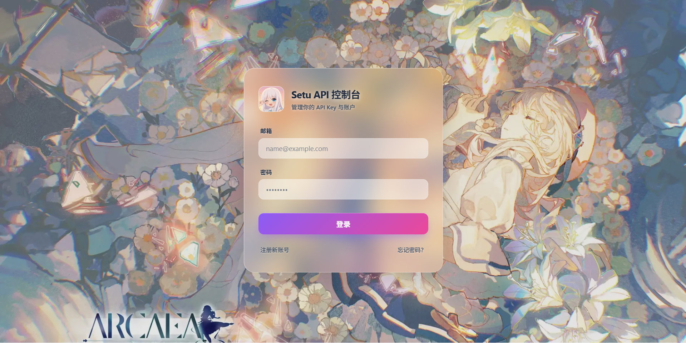
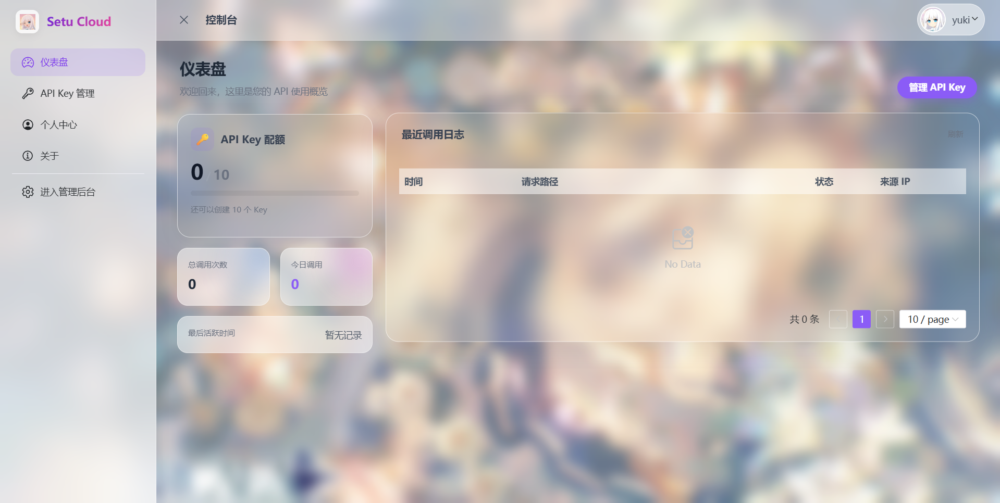
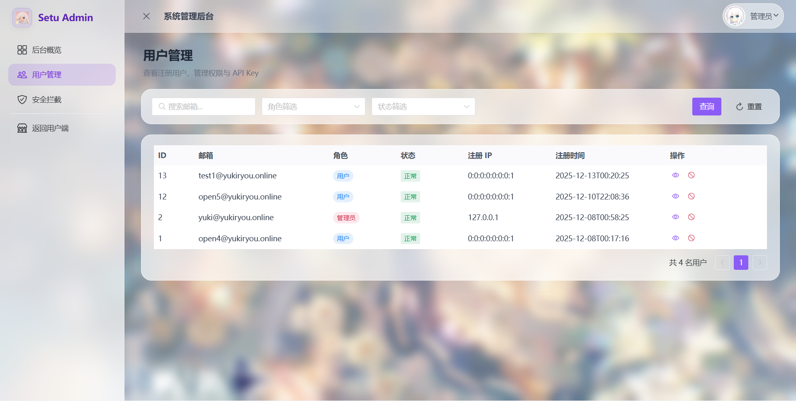
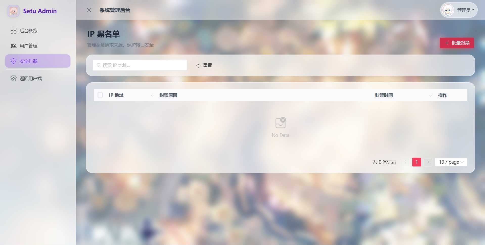

# 雪涼云 Console（雪涼云 API 控制台）

**雪涼云 Console** 是一个现代化、基于 **Aurora Glassmorphism（极光毛玻璃）** 风格的 API 管理控制台。面向雪涼云 API，提供用户配额管理、API Key 申请以及完善的后台管理能力。

界面设计采用二次元背景与高斯模糊玻璃质感，并使用 Naive UI 构建顺滑的交互体验。

## ✨ 功能特性

### 👤 用户端（User Dashboard）

- **仪表盘概览**：可视化展示 API 调用统计、配额使用情况与系统公告  
- **API Key 管理**  
  - 支持创建、重命名、禁用、删除 API Key  
  - 实时查看单个 Key 的调用次数与剩余配额  
  - 一键复制 Key，并提供安全展示机制  
- **个人中心**：管理个人资料、修改密码、查看登录日志  
- **自适应布局**：适配移动端与桌面端，支持侧边栏收缩  

### 🛡️ 管理员后台（Admin Panel）

- **权限隔离**：独立管理员路由与深紫色主题区分，支持从用户端一键跳转  
- **后台概览**：实时监控全站 API 调用总量与系统运行状态  
- **用户管理**  
  - 分页查看所有注册用户  
  - 支持按邮箱、角色、状态进行多条件搜索  
  - **用户详情抽屉**：查看用户基础信息及其名下所有 API Key 详情  
  - 一键封禁/解封违规用户  
- **安全拦截（IP 黑名单）**  
  - **批量封禁**：支持批量粘贴多行 IP 执行封禁  
  - **批量解封**：支持多选 IP 执行解封  
  - 前端实时搜索与排序  

## 🛠️ 技术栈

| 模块 | 技术选型 | 说明 |
| --- | --- | --- |
| 核心框架 | Vue 3（`<script setup>`） | 使用 Composition API 构建 |
| 构建工具 | Vite 5 | 极速冷启动与热更新 |
| 语言 | TypeScript | 全类型约束，更安全可靠 |
| UI 组件库 | Naive UI | 高度可定制的 Vue 3 组件库 |
| 状态管理 | Pinia | 轻量级状态管理 |
| 路由 | Vue Router 4 | 含动态权限路由守卫 |
| HTTP 客户端 | Axios | 封装拦截器处理 Token 与 401 刷新 |
| 图标库 | @vicons/ionicons5 | Ionicons 5 图标集 |
| 风格 | CSS Variables + Scoped CSS | 手写毛玻璃效果与动画 |

## 📸 项目预览

> 若图片不在同目录，请把下方图片路径改成你的实际位置（例如 `./images/xxx.png`）。

| 登录页面 | 用户仪表盘 |
| --- | --- |
|  |  |

| 用户管理 | IP 黑名单 |
| --- | --- |
|  |  |

## 🚀 快速开始

### 环境要求

- Node.js >= 16.0
- pnpm（推荐）或 npm/yarn

### 1. 克隆项目

```bash
git clone https://github.com/your-username/xueliang-cloud-frontend.git
cd xueliang-cloud-frontend
```

### 2. 安装依赖

```bash
pnpm install
```

### 3. 配置环境变量

在项目根目录新建 `.env` 文件（参考 `.env.example`）：

```ini
# 后端 API 地址
VITE_API_BASE_URL=http://localhost:9898

# 网站标题
VITE_APP_TITLE=雪涼云
```

### 4. 启动开发服务器

```bash
pnpm dev
```

访问 `http://localhost:5173` 即可看到效果。

### 5. 构建生产版本

```bash
pnpm build
```

## 📂 目录结构

```text
src/
├── api/                # API 接口封装 (Admin, User, Auth)
├── assets/             # 静态资源 (Logo, Background images)
├── components/         # 公共组件 (AuthLayout 等)
├── layouts/            # 布局组件
│   ├── UserLayout.vue  # 用户端布局 (浅紫色主题)
│   └── AdminLayout.vue # 管理员布局 (深紫色主题)
├── router/             # 路由配置与权限守卫
├── stores/             # Pinia 状态管理 (Auth Store)
├── styles/             # 全局样式
├── views/              # 页面视图
│   ├── admin/          # 管理员页面 (Users, Blacklist...)
│   ├── auth/           # 认证页面 (Login, Register...)
│   └── dashboard/      # 用户仪表盘页面
├── App.vue             # 根组件
└── main.ts             # 入口文件
```

## 📝 开发规范

- **风格**：新建页面请继承 `.glass-card` 与 `.glass-table` 类，保持全局毛玻璃风格统一  
- **图标**：统一使用 `@vicons/ionicons5`  
- **API**：所有接口请求需要在 `src/api` 下定义对应的 TypeScript 类型（接口/DTO）  

## 📄 许可证

[CC BY-NC-SA 4.0](https://creativecommons.org/licenses/by-nc-sa/4.0/) License © 2025 Yuki Ryou  

[//]: # ()
